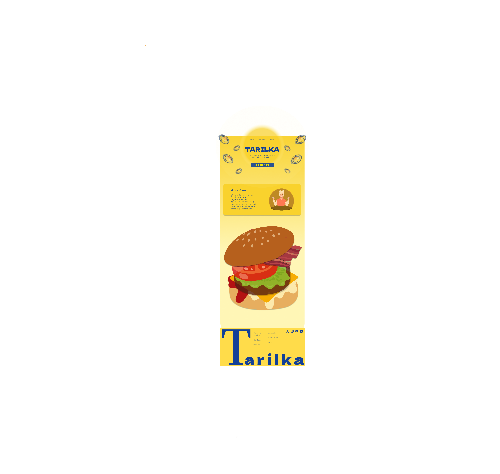

# 🍽️ TARILKA

<div  align="center">


**An interactive design prototype and homepage code example for a catering business website.**

[Live Figma Prototype](https://www.figma.com/proto/fmIvVYeeGOm546HcfY7An7/Tarilka?node-id=1-6&starting-point-node-id=1%3A113&t=J2zEz51IZckm6Jr4-1)

</div>

## 📖 Overview
Last year I created a portfolio, which required building of the portfolio and I decided to do the branding of the catering business "Tarilka", which in translation from Ukrainian means plate. And I thought it would be a good idea to continue working on its identity, so decided to make a website for the "organisation". This repository showcases an interactive prototype  for the "Tarilka" website which was created using Figma. Additionally, using plugins in the Figma, I created simple version of code that could be used, which contains HTML, CSS and jQuery for visualising how it can potentially look at the development stage. Also, I included folder with my last year's work in examples of booklet, leaflet and logo

## ✨ Features

-   **Interactive Figma Prototype**: A clickable design prototype showcasing the entire website's user interface and user experience, accessible via Figma.
-   **Functional Homepage Example**: A clean, standalone HTML, CSS, and JavaScript(jQuery) implementation of the website's homepage.
-   **UI/UX Design**: Demonstrates contemporary design principles suitable for catering and hospitality businesses, including appealing layouts for services, menus, and contact information.
-   **Basic Interactivity**: Integration of JavaScript (jQuery) for smooth user interactions and potential dynamic content elements on the homepage.


## 🖥️ Screenshots

<!-- TODO: Add actual screenshots of the Figma prototype and the rendered code_example homepage here. Ensure mobile and desktop views are included. -->
<!-- Example: -->



## 🛠️ Tech Stack

**Design & Prototyping:**


**Frontend:**


## 🚀 Quick Start

This project is primarily a prototype and does not require you to download any files, they are uploaded to this repository just as examples.The main product is the interactive prototype which you can access through the links and I showed how to do this in the demo video above.

[Demo Video](https://youtu.be/O-XiIKpeZIY)


Although, if you want to download any files there are instructions how to do it, and there are no complex build steps or server requirements: 

### Prerequisites
-   A modern web browser (e.g., Chrome, Firefox, Safari, Edge) to view the `code_example`.
-   Figma account (optional, for editing the design file).

### Installation

1.  **Clone the repository**
    ```bash
    git clone https://github.com/sofiaplyak/TARILKA.git
    cd TARILKA
    ```

2.  **Explore the Figma Prototype**
    Open the `Tarilka.fig` directory (which contains the Figma file). You can open the Figma file directly in your Figma desktop application, or view the live interactive prototype at the link above.

3.  **View the Homepage Code Example**
    Navigate to the `code_example` directory.
    ```bash
    cd code_example
    ```
    Open the `tarilochka.html` file directly in your web browser.
    ```bash
    # Example command for Linux/macOS
    open tarilochka.html
    # Or simply double-click html file from your file explorer
    ```

## 📁 Project Structure

```
TARILKA/
├── Exported_images/    # Exported figma frames as png images 
├── Tarilka.fig/        # Contains the Figma design file for the interactive prototype
├── code_example/       # HTML, CSS, and JavaScript files for the homepage example
│   ├── tarilochka.html      # The main homepage file
│   ├── index.css            # Detailed stylesheet for the homepage
│   └── global.css           # General stylesheet for homepage
├── references/         # External resources/ previous portfolio work with braind identity
└── README.md           # This README file
```

## ✨ Usage
  This project can be used as an example to show to stakeholders how their website could work and how it could look. Usually interactive prototypes are the tools for visualising a variety of interactive designs in the project. Also, prototypes can be really helpful for the designers as they turn a cocnept into reality, and using it, designers could find unintended scenarios and usability problems while testing before the actual development and launch.

## 🖥️ AI Acknowledgement and Resources reference
  Firstly, in the actual designing and developing of the prortotype none of the known AI agents were used, but for the example of the code I used plugin: "Locofy Lighting - Figma to Code in a flash", which you can add to your workspace at the plugin section in the Figma.
  
  Also, for building/writing the ReadMe file I used ReadMe generator: https://readme.so/editor, which helped with the design parts of the document and proper explanation of setup instructions and project structure.
  
  For the information on the prototype menu page I used real-world examples, which want to include above:
  
- starters: 
      https://www.olivemagazine.com/recipes/collection/best-ever-starter-recipes/
      
- mains:
        https://www.epicurious.com/recipes-menus/dinner-party-main-course-recipes-gallery
  
- desserts:
       https://www.olivemagazine.com/recipes/collection/easy-desserts-recipes/
    
- cocktails/drinks:
        https://www.allrecipes.com/article/top-50-cocktail-list-and-recipes/
<div align="center">


**⭐ Star this repo if you find it helpful or inspiring!**

Made ❤️ by [sofiaplyak](https://github.com/sofiaplyak)

</div>


